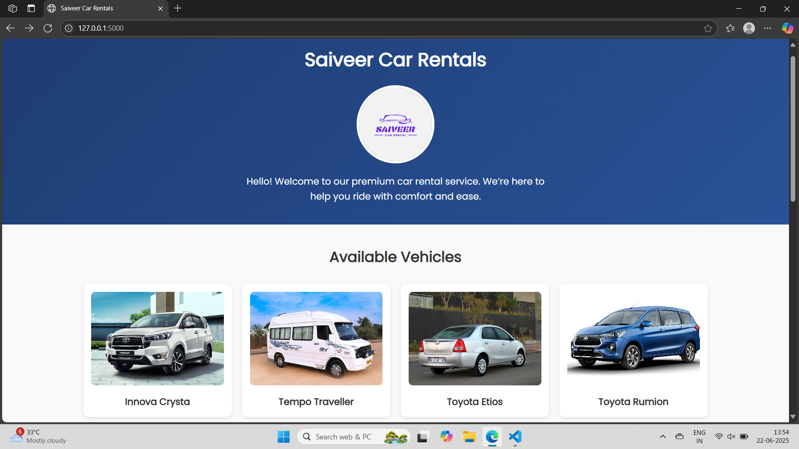
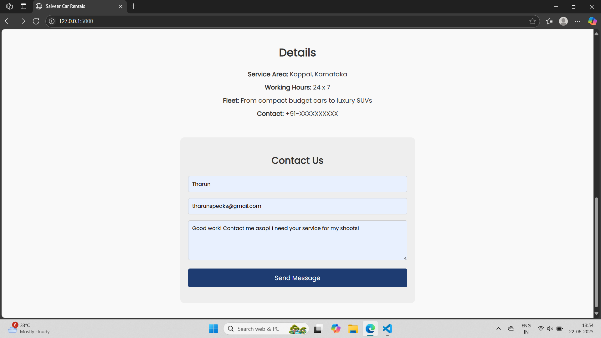
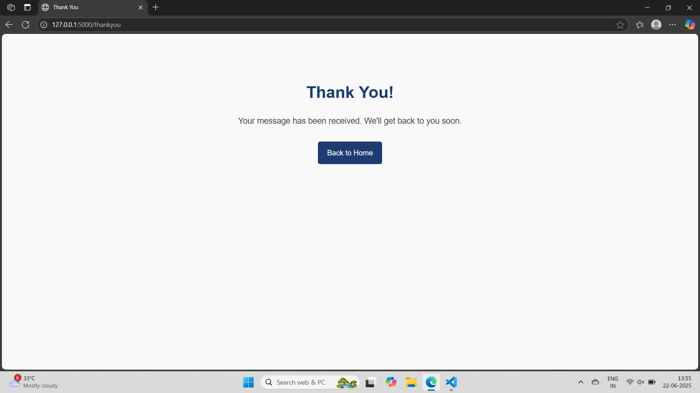
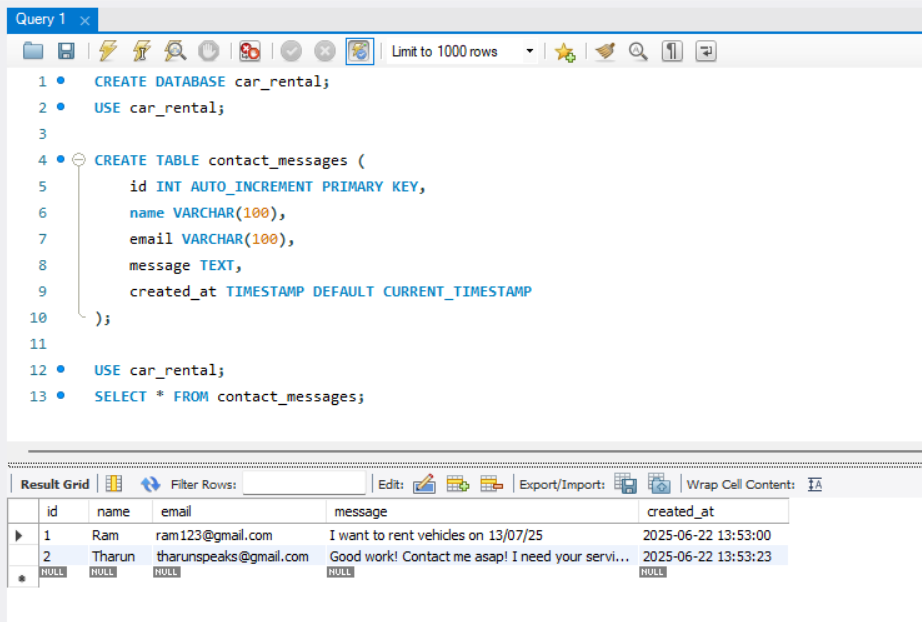

# 🚗 Car Rental Website with MySQL Integration

A responsive web application built using Flask, HTML, and CSS to showcase a fleet of rental vehicles and collect customer inquiries via a contact form. All messages are stored in a MySQL database for easy management.

## 💻 Tech Stack

- **Frontend:** HTML, CSS
- **Backend:** Python (Flask)
- **Database:** MySQL
- **Tools:** Git, GitHub

## 📌 Features

- Owner profile and welcome message
- Responsive vehicle gallery 
- Contact form to collect user inquiries
- MySQL backend to store messages
- Thank-you page on successful submission

## 🛠️ Setup Instructions

1. Clone the repository:
   ```bash
   git clone https://github.com/yourusername/car-rental.git
   cd car-rental
2. Create a virtual environment and activate it:
    ```bash
    python -m venv venv
    venv\Scripts\activate  # Windows
3. Install dependencies:
    ```bash
    pip install -r requirements.txt
4. Set up MySQL database:
    Create a database named car_rental
    Run the following SQL:
    ```sql
    CREATE TABLE contact_messages (
        id INT AUTO_INCREMENT PRIMARY KEY,
        name VARCHAR(100),
        email VARCHAR(100),
        message TEXT,
        created_at TIMESTAMP DEFAULT CURRENT_TIMESTAMP
    );
5. Run the app:
    ```bash
    python app.py
6. Visit:
    ```cpp
    http://127.0.0.1:5000/
    
## 📂 Folder Structure 
```arduino
car-rental/
│
├── app.py
├── db/
│   └── connect.py
├── templates/
│   ├── index.html
│   └── thankyou.html
├── static/
│   ├── style.css
│   └── vehicles/
│       ├── car1.jpg
│       ├── ...
├── README.md
├── requirements.txt

## 📸 Screenshots

### 🏠 Home Page


### 📨 Contact Form


### 🙏 Thank You Page  


### 🗃️ Contact Details Stored in MySQL  

